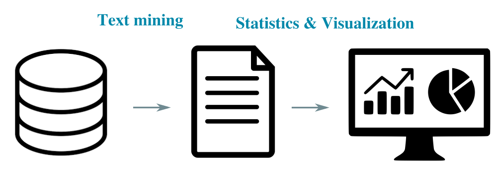

# puboracle
Extracting insights from scientific publications in the life sciences

# Description
*puboracle* is a package that combines text mining, natural language processing, and geocoding to extract key information that pertains to the domain of scientific publications in the life sciences. 

The package offers a collection of functions for mining, analyzing and visualizing textual information and meta-data related to published scientific articles.

The package facilitates obtaining an overview of research activity (e.g., the location of resarch hubs across the globe) in relation to keywords of interest (e.g., stroke-related research) in a compact way.

Key insights spanning several years of research output in the domain of life sciences can be obtained in few lines of code, offering a plethora of analysis by combining the functions offered from this package in different ways.

# Installation

Download or clone the repository. It is advisable to create a virtual environment (e.g., with conda) with the requirements.txt

Open a terminal and change to the corresponding folder. 

Type:

`
pip install .
`

# Example
The package comes with a Jupyter Notebook that showcases how *puboracle* can be used. The example in the notebook offers insights into articles that were published in the last 30 days. Specifically, the following key information is extracted and visualized:

i. Geospatial information concerning the location (longitude and latitude) of the institutes or universitites where the published research took place. 

ii. The top 10 locations in the world where the most publications in the last 30 days were produced.

iii. Network of collaborations among the universitites and institutes where the published research took place. 

# Citation
If you find any of the functions of this package useful, please do cite it as follows:

`
@misc{Goulas2020,
author = {Goulas, Alexandros},
title = {puboracle},
year = {2020},
publisher = {GitHub},
journal = {GitHub repository},
howpublished = {\url{https://github.com/AlGoulas/puboracle}}
}
`

